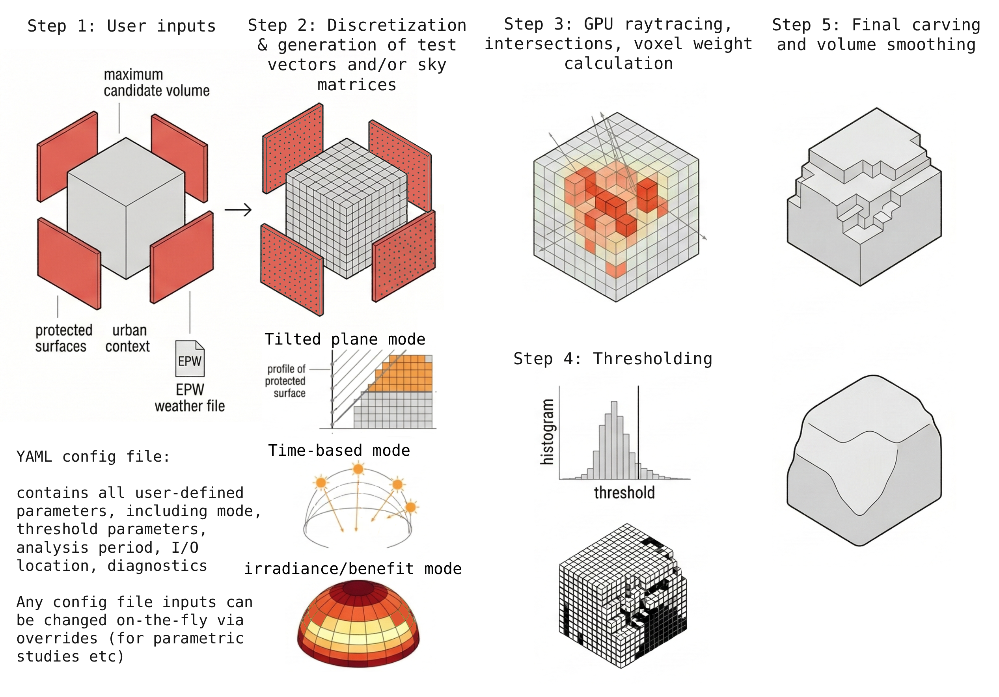
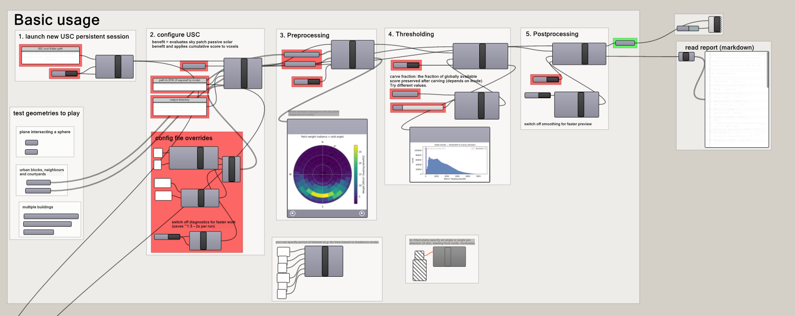
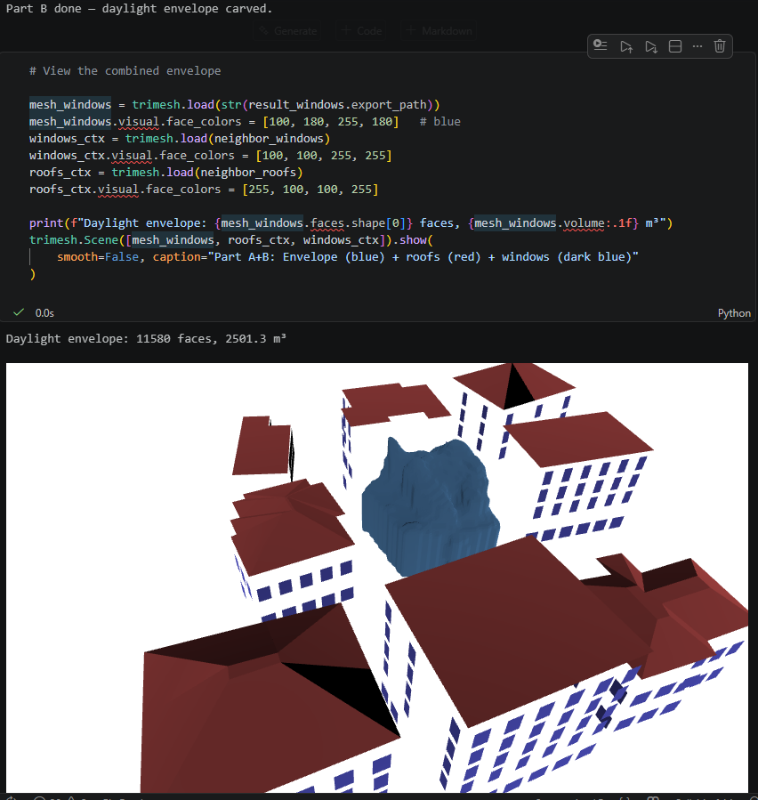

# Urban Solar Carver

[](https://www.python.org/downloads/)
[](LICENSE)

Urban Solar Carver (USC) is a Python library for generating maximum buildable volumes that respect solar access, daylight, and thermal comfort constraints in urban environments. It uses GPU-accelerated voxel carving driven by climate data to produce 3D building envelopes ready for urban planning, design, and architectural applications.

> **Upcoming:** USC will be presented at [ReSBE 2026](https://resbe2026.web.auth.gr/) (ReShaping the Built Environment through Sustainability and Circularity), 20-23 October 2026, Thessaloniki, Greece.



## How It Works

The user provides a **maximum volume mesh** (the theoretical buildable mass, e.g., a block extrusion from zoning boundaries), a set of **test surfaces** (planar faces whose solar or daylight access must be protected, such as facades, courtyards, or PV arrays), an **EPW weather file** for the site location, and a **YAML configuration** specifying the carving mode, analysis period, and thresholding parameters.

USC voxelizes the maximum volume, casts rays from the test surfaces toward the sky, and scores each voxel by how much it obstructs the environmental quantity of interest (solar radiation, daylight, sky view). A threshold is then applied to produce a binary carving mask, and the surviving voxels are reconstructed into a mesh: the maximum developable volume that satisfies the given constraints.

The pipeline has three stages: **preprocessing** (score computation), **thresholding** (binary mask), and **exporting** (mesh reconstruction). Each stage is independently re-runnable: change the threshold without recomputing scores, or swap export settings without re-thresholding.

The tool is scale-agnostic and works on any voxelizable geometry. Surface normals must face outward (toward the direction of carving). Test surfaces can be placed anywhere, including inside the maximum volume (e.g., to carve a courtyard or an interior void).

## Carving Modes

| Mode | Description |
|------|-------------|
| **tilted_plane** | Cuts voxels above a fixed angle from each test surface, uniform or varying by orientation octant. Suitable for daylight access envelopes and quick regulatory checks. No weather data required. |
| **time-based** | Solar envelope: traces actual sun paths for specific dates and hours, carving any voxel that casts a shadow on protected surfaces during those times. |
| **irradiance** | Weights sky directions by cumulative solar energy over an analysis period (direct + diffuse, Perez all-weather model). |
| **benefit** | Like irradiance, but filtered by a heating-benefit criterion: only hours when outdoor temperature falls below the building's balance-point temperature contribute, focusing carving on periods when solar gain is thermally useful. |
| **daylight** | Weights sky patches by CIE overcast luminance for diffuse daylight access. |
| **radiative_cooling** | Preserves sky-dome access for passive nighttime cooling using Martin-Berdahl emissivity. Works inversely (rays cast from surfaces to sky). Horizontal surfaces only (experimental). |

## Thresholding

After scoring, a threshold determines which voxels to carve and which to keep. The threshold controls the trade-off between solar protection and buildable volume:

| Strategy | Config | Recommended for |
|----------|--------|-----------------|
| **Carve fraction** | `threshold: carve_fraction`<br>`carve_fraction: 0.7` | Design exploration. Directly controls how much obstruction to remove: 0.7 = aggressive (taller, slimmer volumes, more solar access), 0.3 = conservative (bulkier volumes, more floor area). Think of it as a **solar protection slider**. |
| **Head-tail breaks** | `threshold: headtail` | Heavy-tailed distributions. Biased toward removing only the worst obstructors, preserving more buildable volume when most voxels have low scores. |
| **Manual** | `threshold: 0.35` | Expert use. Carves all voxels with score above this value. Inspect the score histogram (`diagnostics: true`) first. |

The strategies above apply to the **weighted modes** (`irradiance`, `benefit`, `daylight`, `radiative_cooling`). The two binary modes have fixed semantics: **`tilted_plane`** has no threshold (voxels above the cut plane are always removed); **`time-based`** uses an integer violation count (`threshold: 0` = remove any voxel that casts a shadow even once, `threshold: 1` = tolerate one time step, etc.).

The **decomposed pipeline** is designed for threshold exploration: compute scores once (the expensive step), then re-run thresholding with different values instantly.

https://github.com/user-attachments/assets/7fb20820-bd24-4ccd-86f5-4f4f868b372a

## Features

- **GPU-accelerated** ray tracing via NVIDIA Warp, with CPU fallback
- **Grasshopper plugin** for Rhino 3D with 17 components and persistent GPU daemon
- **3-stage pipeline** (preprocessing, thresholding, exporting), each re-runnable independently
- **YAML configuration** with CLI overrides (`-o voxel_size=0.5 -o mode=irradiance`) and mode-specific templates
- **Smooth or cubic meshes**: marching cubes + Taubin smoothing, or axis-aligned voxels


## Installation

### Python (API, CLI, Jupyter)

```bash
git clone https://github.com/avarth/UrbanSolarCarver.git
cd UrbanSolarCarver
python setup_env.py
```

Auto-detects your GPU and installs the correct PyTorch + CUDA wheels. Use `--cpu` for CPU-only mode.

### Grasshopper (Rhino 3D)

1. Complete the Python installation above.
2. Copy all `.ghuser` files from `grasshopper/USC_GHplugin/` into your Grasshopper User Objects folder.
3. On the Grasshopper canvas, use the **USC_Session** component to start the GPU daemon.



## Usage

```python
from urbansolarcarver import load_config, run_pipeline

cfg = load_config("config.yaml")
result = run_pipeline(cfg, out_dir="./outputs")
```

Run stages independently to change threshold parameters without recomputing scores:

```python
from urbansolarcarver import load_config, preprocessing, thresholding, exporting
from pathlib import Path

cfg = load_config("config.yaml")
pre = preprocessing(cfg, Path("out/pre"))
thr = thresholding(pre, cfg, Path("out/thr"))
exp = exporting(thr, cfg, Path("out/exp"))
```

CLI:

```console
$ urbansolarcarver preprocessing -c config.yaml
$ urbansolarcarver thresholding -c config.yaml -f out/pre/manifest.json
$ urbansolarcarver exporting -c config.yaml -f out/thr/manifest.json

# Override any config parameter on the fly
$ urbansolarcarver preprocessing -c config.yaml -o voxel_size=0.5 -o mode=irradiance

# View all available parameters
$ urbansolarcarver schema
```

Mode-specific config templates are in `configs/`. See [Configuration](https://avarth.github.io/UrbanSolarCarver/getting-started/configuration/) for the full parameter reference.

## Documentation

[**avarth.github.io/UrbanSolarCarver**](https://avarth.github.io/UrbanSolarCarver/): installation options, configuration reference, mode theory, Grasshopper setup, API docs.

Tutorial notebooks are in [`examples/`](examples/).



## Research Context

USC extends the lineage of voxel-based solar form-finding, from Knowles' solar envelope through iso-solar surfaces and solar ordinance methods, into a unified, climate-aware, GPU-accelerated framework.

## Citation

A publication describing USC is in preparation. Citation details will be added here upon publication.

## Built With

[PyTorch](https://pytorch.org/) · [NVIDIA Warp](https://github.com/NVIDIA/warp) · [Ladybug Tools](https://www.ladybug.tools/) · [Trimesh](https://trimesh.org/) · [Shapely](https://shapely.readthedocs.io/) · [scikit-image](https://scikit-image.org/)

## AI-Assisted Development

This tool was developed with AI assistance (OpenAI ChatGPT 4.1 and Anthropic Claude Opus 4.6 / Sonnet 4.6). The author designed the architecture and planned all features; AI tools were used to draft code diffs, code cleanup and implementation. All AI-generated code was reviewed by the author before inclusion. The author takes full responsibility for the correctness, design, and scientific validity of the code.

The scientific methodology, analysis modes, and validation are entirely the author's work. AI tools were not used in the formulation of the research approach or interpretation of results.

## License

[AGPL-3.0](LICENSE). This software is provided as-is with no warranty. See [LICENSE](LICENSE) for details. For commercial licensing inquiries, contact the author.

## Author

[Aristotelis Vartholomaios](https://orcid.org/0000-0001-6177-1130), Department of Planning and Regional Development, University of Thessaly, Volos, Greece. Contact: avartholomaios@uth.gr
